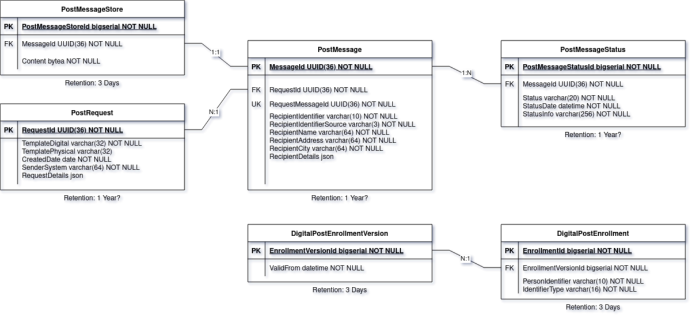

# Digital Post Komponent
Github repository hosting the setup for the Digital Post Komponent.

## Project Architecture
[](https://mermaid.live/edit#pako:eNqNU9FugjAU_ZWmT1ti9Z2HJSig20xGKG_FhwoXaYRCStmyGD9nX7IfW9E50KGxT-Xec0_OObfscFwmgC1MCIlkKHQOFnLERmieI7-sNXoti6qUIHUkD5g0Lz_ijCuNlkEkkTk2CxVPUxGvjt91s94oXmVXedDvmbLApSGioN5FDCtC0IsznSFCntqJjYK6w86YI-qK6zgDdTkxPGCa88A_0LnsTErHtBrGe4xq9f2Vp6Wqh9EO8x3vT0dXd3ssTlf2hstz5kpV5nkB-r4UFiyAGER1J_xUYQ-nG3K45mtew-OvaJDJja31DD_PaXgW45nrMVqEoU_R2PhrkT2PN3qLK73_osw-OD_sox9qb5qGgW0vvbeA9nZ36dE2MaFM66q2JpPk6IVUxgvZnl7nONlO2jDRFI9wAargIjG_x64liLDOoIAIW-aaQMqbXEc4knsD5Y0u6aeMsaVVAyPcVAnX4Ahu9BfYSnlew_4HlvkIZQ)

## DPK-Projects
- [REST-Service](https://github.com/trifork/dpk-rest-service): Service implementing the REST API that calling systems will use to send post
- [PDF-Service](https://github.com/trifork/dpk-pdf-service): Service responsible for creating PDFs to be sent to Digital Post or Strålfors based on a template
- [Dispatcher-Service](https://github.com/trifork/dpk-docs): (Cron/Batch) Service responsible for figuring out which letters to send and which specific dispatcher service should send it. Also handles some sub-dispatcher errors
- [Strålfors-Dispatcher-Service](https://github.com/trifork/dpk-straalfors): Service responsible for having PDFs generated for a physical letter and sending it to Strålfors
- [Digital-Post-Services](https://github.com/trifork/dpk-digital-post): Github repository containing all relevant Digital Post services
  - [Digital-Post-Dispatcher-Service](https://github.com/trifork/dpk-digital-post): Service responsible for having PDFs generated for digital post and sending it to Digital Post
  - [Enrollment-Service](https://github.com/trifork/dpk-digital-post) - (Cron/Batch) Service responsible for maintaining Digital Post enrollment lists
  - [Receipt-Service](https://github.com/trifork/dpk-digital-post) - (Cron/Batch) Service responsible for maintaining Digital Post receipts
- [Common-Submodule](https://github.com/trifork/dpk-common-submodule) - Github submodule containing the datamodel (SQL) and protobuf messages
- [Flux](https://github.com/trifork/dpk-docs) - TCS dev/test repository
- [Docker](https://github.com/trifork/dpk-docker) - Repository hosting a docker-compose setup

## Technology Used
* **Git** for source control, and **Github** as source repository
* **Github Workflow** for continuous integration
* **Java 21**, **Kotlin 1.9.22** and **Go 1.22** as programming language
* **Maven** for building the Java/Kotlin services
* **Makefile** for easy scripting of Go build and run targets
* **Docker** for containerization
* **Github Container Registry** as docker image repository
* **PostgresDB** for persistence
* **SpringBoot** for Java/Kotlin projects
* **protobuf** and **gRPC** for communication
* **Kubernetes** as the infrastructure environment (hosted at Netic)
* **kubectl** CLI for accessing the Kubernetes cluster and viewing logs

## API
The following endpoints are available through the API:

> # /api/v1/sendPDF
>
> *Starts sending PDFs to the specified recipients*
> | Query Parameter             | Description                                                                                                                               | Mandatory    |
> |-----------------------------|-------------------------------------------------------------------------------------------------------------------------------------------|:------------:|
> | recipientList               | Liste af modtagere                                                                                                                        | X            |
> | templateDigital             | Template name for digital letters                                                                                                         | X            |
> | templatePhysical            | Template name for physical letters, can be kept empty to disallow physical letters                                                        |              |
> | templateSubstitutionValues  | Key-Value mapping for substituting generic values in the template                                                                         |              |
> | sendDate                    | (Future) date where the service should being sending the post from, if not specified the service will send as soon as possible            |              |
>
> *Json example of a request*
> ```json
> {
>  "recipientList": [
>   {
>    "messageId": "f47ac10b-58cc-4372-a567-0e02b2c3d479",
>    "identifier": "1111111118",
>    "identifierSource": "CPR",
>    "name": "Jens Jensen",
>    "address": "Jensenvej 11, 8000",
>    "city": "Testby",
>    "substitutionValues": {
>     "age": "31"    
>    }
>   }
>  ],
>  "templateDigital": "Genoplivning_paamindelse_2024q4_digital",
>  "templatePhysical": "Genoplivning_paamindelse_2024q4_fysisk",
>  "templateSubstitutionValues": {
>   "date": "2023-01-29"    
>  } 
> }
> ```
> *identifierSource` is not required and assumed to be CPR if not specified. `substitutionValues` is not a mandatory value.*
>
> The service returns the following response
> ```json
> [
>  {
>   "message_id": "The UUID for the relevant request",
>   "status": "OK/Error",
>   "error_code": "Error code, if any error",
>   "error_description": "Error description, if any error"
>  }
> ]
> ```

## Database
We're working with a single Postgres database for all environments (local, dev, test, and prod) with the following ER diagram:


## Continuous integration

We use Github Actions as our continuous integration flow, which triggers build and test runs for every PR created and on the main branch.

The Github workflow, which has been enabled at setup for each repository, will build the source code and run the available unit tests on each branch in the repo.

An overview and status of the workflow runs can be viewed in the `Actions` tab of each project.

## Continuous deployment

We take advantage of the ideas behind [GitOps](https://www.gitops.tech/) for working with CI/CD in the CTR project. 

We use Github Actions and have added a workflow for continuous deployment. So when a new release has been created (manually, from Github Releases) of a given repository, it triggers the Github action for build and deployment of the service.

We use Github Container Registry to store the built release images of the services. The images which are built and are available can be viewed from the `Pakcages` site on the repository (found in the right hand side of the Code tab).

The deployment process is maintained by [flux](https://fluxcd.io/) using helm charts for deployng docker images to Kubernetes.

## Release procedure

This section describes how to create a new release and publish the built docker image to Github Container Registry automatically:

We use Github actions for managing workflows in the DPK project. This means that the workflow named "Build and test code" is triggered when a pull request is merged to the main branch, and the workflow for building and publishing a Docker image of the service is triggered when a release is created.

### Create a new release

Navigate to the `Releases` section in the Code tab of your Github repo (in the right hand side of the page) and press the `Draft a new release` button. Create a new tag, for example v0.0.7 and add a title for your release, for example `Release v0.0.7`.

Check the check-box `This is a pre-release`, if this is a pre-release version, and then press the `Publish release` button. A release should be marked as pre-release if it's not production ready (or not expected to be deployed to production).
